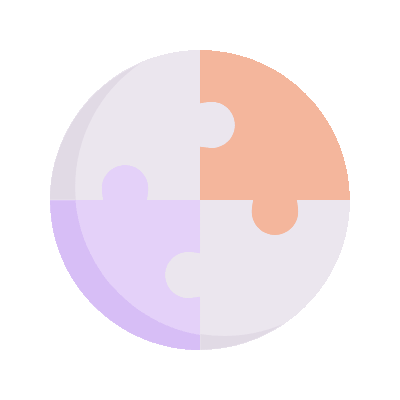

<!-- Dynamic AI Banner GIF -->

  

#  Welcome to My GitHub Profile ! 
**AI & Data [Research] Scientist | Full-Stack Developer | M.Sc. Industrial and Financial Economics | Research Experience**
---
[;Familiarity+with+SQL+for+querying+relational+datasets;Sound+understanding+of+ML+fundamentals+%E2%80%93+supervised%2Funsupervised+learning+methods;Good+statistics+foundation+%E2%80%93+distributions%2C+hypothesis+testing%2C+probability;Ability+to+interpret+data%2C+derive+insights%2C+and+present+conclusions+clearly;Knowledge+of+BI+tools+(Power+BI+%2F+Tableau);Basics+of+cloud+platforms+(Azure+%2F+AWS)+;Good+command+of+HTML5%2C+CSS3%2C+Javascript;Good+knowledge+of+object-oriented+programming;Hands-on+experience+with+CI%2FCD+pipelines;Fluency+in+French+and+English;Strong+problem-solving+skills+and+attention+to+detail;Great+communication+skills%2C+ownership+mindset+%26+enthusiasm+to+learn;Fast+learner+who+adapts+easily+to+change;Autonomous%2C+proactive%2C+and+meticulous+in+my+work;Good+grasp+of+the+main+modern+DS+and+ML+techniques+(Statistical+learning%2C+machine+learning%2C+deep+learning);Experience+with+data+scripting+languages+(SQL%2C+Python%2C+R)+;Experience+with+statistical%2Fmathematical+software+(R%2C+SAS%2C+Matlab);Experience+with+big+data+(processing%2C+filtering%2C+%26+presenting+large+quants);Experience+implementing+algorithms+using+both+toolkits+and+self-developed+code;Sound+interest+in+generative+AI%2C+%26+large+language+models;Obsessed+Data+Scientist+;Insatiably+curious+and+always+want+to+learn+more;Write+clean+code+with+clear+documentation;Proficiency+in+C+programming)](https://git.io/typing-svg)

##  Technologies & Tools 

  
  
  
  
  
  
  
  
   
  
  
  
    
  
  
  

---

##  Featured Projects 
| Project | Description | Live Preview |
|---------|-------------|-------------|
| **OPEN MEDIC 2014-2021** | In this project, I implement SVMs and explore the algorithm through different scenarios depending on the type of kernel. Dans ce projet, j'implémente l'algorithme SVM et l'explore à travers différents scénarios selon le type de noyau kernel. |  |
| **PROJECT TITLE** | Project description |  |
| **PROJECT TITLE** | Project description |  |

---

##  Currently Learning
- Foundations of Cybersecurity | Google Career Certificates | Coursera  
- Google AI Essentials Specialization | Google Career Certificates | Coursera
- Google Data Analytics Professional Certificate | Google Career Certificates | Coursera

---
<!-- Dynamic Banner GIF -->

  
  
  

## 
 Mad Skills

- ♟️ obsessed Nordic walker | 🚀 Sci-fi enthusiast | 🎨 AI Art Explorer  
- I like turning ML models into **interactive visualizations and live demos**!

---
##  Connect with Me

  
    
  
  
  
  
  
  

---
## Happy Season Greatings !

    

